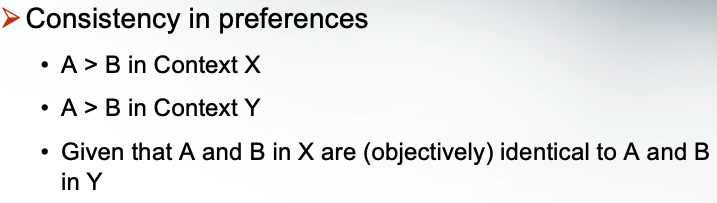

## Thinking and Judgment contains 3 items:
- Problem solving, Judgement & Decision-making (Higher-order mental operaion )
- Arithmetic & Language Processing 
- Perception, Attenion & Memmory (Elementary mental operation)

## This course are from 8 areas to help us to thinking and make judgement 

1. Thinking, Judgement and Rationalliy
2. Perception 
3. Probaility Judgement 
4. Learning to be non-rational
5. Problem Solving
6. Specific Decision Biases
7. Self-Affirmation 
8. Micellaneous

## Thinking, Judgement & Rationality 

Oldest
1. Mindbody problem (我思故我在)
2. British empiricists (我感故我在)
3. Behaviorism of psychology (No need to study thinking )
4. Freudian approach 
    - Conscious thinking vs. Sub-conscious thinking
    - Components of mind 
        1. Id 本我
        2. Super ego 超自我
        3. Ego 自我
5. Information processing approach
    1. human = computer = information processor 
    2. Software of the computer
    3. Not interested in the hardware (though it may be helpful)
    4. The processes from input to output
    5. The internal structure related to the processes
    6. May or may not be related to the hardware!

Input->Storage->Information Retrieval->Information manipulation and/integration->Output

Memory retrieve is stable then Counting 

Which formula below is correct:

if you know some skill it help to solve the question. 
Like paper, or some short skills

## Human rationality 

### 1. Rationality Approach:

People utilize all available information to maximize the outcome 

Example: 

prj A
-10,000*0.5 + 10,000*0.5 = 0 

prj B
-10,000(0.1) + 2,000*0.9 = 800

so prj b better

### 2. Bounded rationality approach 

A assumptions: Limited mental capacity for information processing (people will overload)

Rationality assumptions in classical economics are valid before information overload

People use less accurate strategies when there is information overload

***So Decision errors are common under situations that consume a lot of mental resources***

### 3. Heuritstic approach 

Heuritstic = Mental “shortcut” for judgment and decision making
Assumption: 
- People are generally “lazy” in cognitive processing
- People mainly rely on “heuristics” although there are sufficient mental resources

Tools:  Decision Tree

