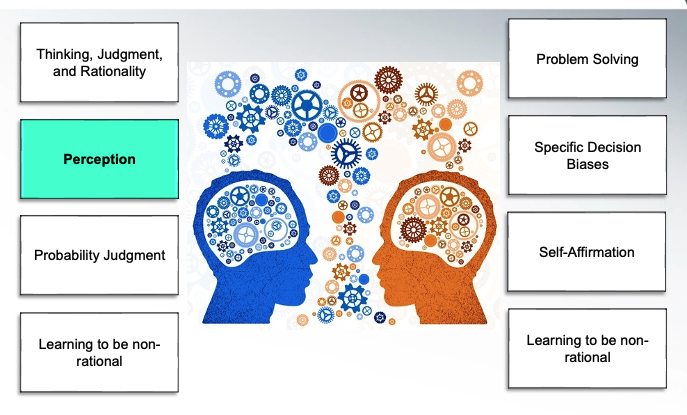
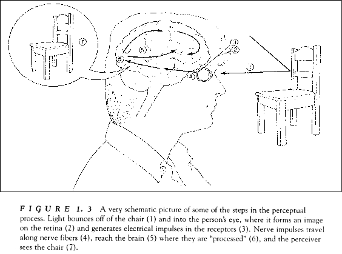
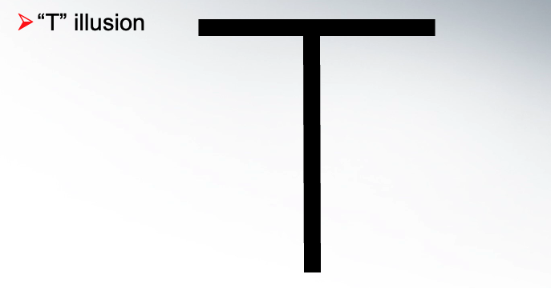
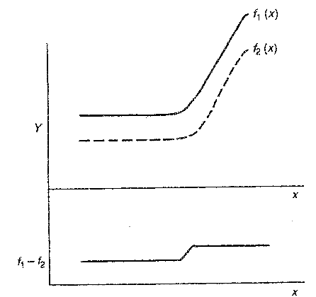

# Week2: Elementtary Thinking processes

## 1. Common Perceptual Biases

1. Sensation vs. Perception

Perception is 

it will introduce Perceptual errors and biases

Example:

Actually the horizontal line anr vertical line is same length 

And it also apply on the graphic 

Perceptual - Managerial implications

The gap is go farer not closer

## 2. Sublimial Perception 

Presenting stimuli that are under physiological/subjective threshold of awareness/consciousness
E.g.:  Presenting/flashing “Drink Coca Cola” in 1/2000 sec (5ms)

Acutally, it is not affect people action 
It is only very short-lived
