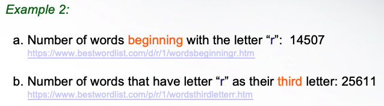
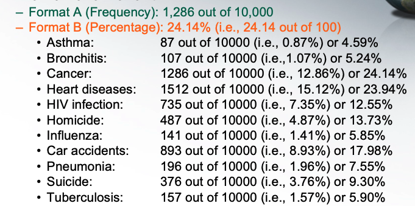
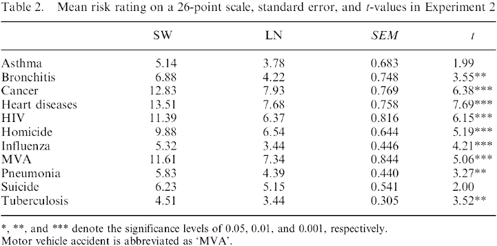
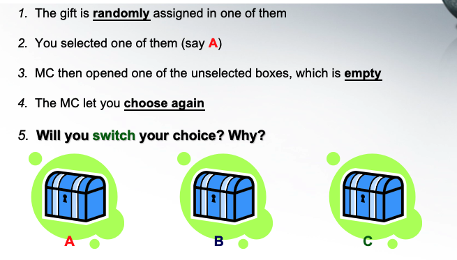
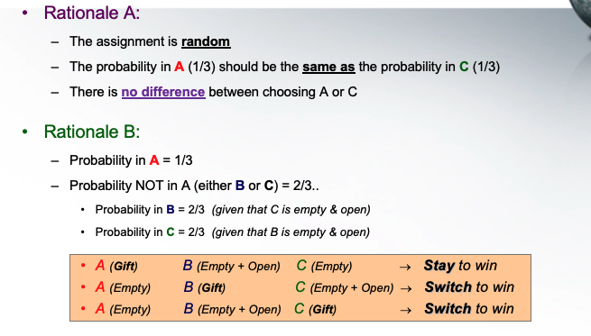
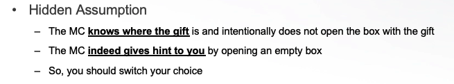
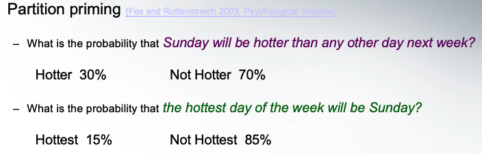
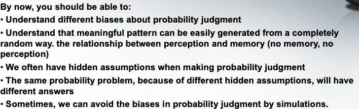
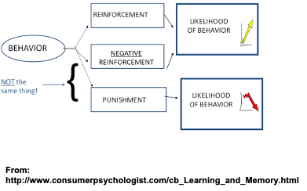
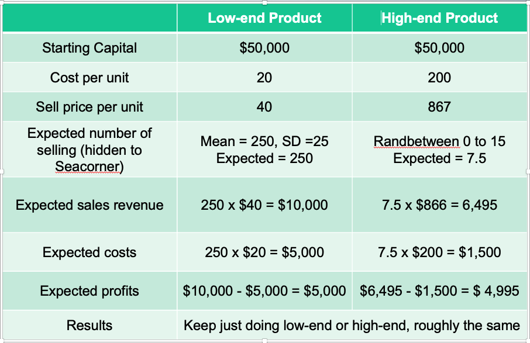

# Week2: Probability Judgement 

## Common biases in Probability judgement 

1. Base rate ignorance 

    - Example:

    The number of suicide increased by 10% in the past 10 years, indicating that the problem is becoming more and more serious 
    
    but the 
    World Population:      
    5.288 billion in 1990 
    7.358 billion in 2015
    
    - Example: 

        
        We may thought the "R" as third letter is smaller

 2. Insensitive to sample size 

    A certain town is served by two hospitals. In the larger hospital, about forty-five babies are born each day. In the smaller hospital, about fifteen babies are born each day. As you know, about 50% of all babies are boys. However, the exact percentage of boys born varies from day to day. Sometimes, it may be higher than 50%, sometimes lower.
    
    For a period of one year, each hospital recorded the days when more than 60% of the babies born were boys. Which hospital do you think recorded more such days

    The larger one
    
    The smaller one
    
    About the same (that is, within 5% of each other).

    Should be the smaller one. since the sample size is larger so the larger hospital is more close to general probaility 

3. The risk of an event 
    
    

4. Regression to mean

    When the father and mother are both very tall (e.g., 2SD higher than the mean), will their son be taller or shorter than them? 

    no 2SD is very weird. they may have to move the mean to right (higher) but no promoise it always on 2SD

5. Conjunction fallacy

    Linda is 31 years old, single, outspoken, and very bright. She majored in philosophy. As a student, she was deeply concerned with issues of discrimination and social justice, and also participated in anti-nuclear demonstrations. 

    Rank the following in order of the probability (from very likely to less likely)
    A.   Linda is a teacher in an elementary school 
    B.   Linda works in a bookstore and takes yoga classes
    C.   Linda is active in the feminist movement
    D.   Linda is a psychiatric social worker
    E.   Linda is a member of League of Women Voters
    F.   Linda is a bank teller
    G.   Linda is an insurance salesperson
    H.   Linda is a bank teller who is active in the feminist movement
    
    it is all independent so may not be happens on the same time 

Fun experimemt 

    filp coin to head-tail game over 200 times

    6 heads in sequence will appear 1 - 2 times

    1/2*1/2*1/2*1/2*1/2*1/2 =  0.015625

    *** we can  avoid the biases in probability judgment by simulations

## Probability paradox

But the case is ppl may do not know the gift are
(always appear in real world)

people will be fool by the wording 

# Learning to be non-rational 

## adaptive learning 

“a” is a learning parameter
Proportion of the newest information to regulate the next behavior
To be adaptive, a > 0
No learning when a = 0
Maladaptive learning when a < 0
One-trial learning when a = 1

people will have learning on the first time, for example, if you find very good taste resturant. but next time go there. Maybe not that good

but it become the option is stable or risky 

The suggestion:
The “Natural-Selection” mechanism would led Seacorner toward selling more High-end products.  

The key learning message from this exercise is that although from the “learning to be non-rational” class, we know that people generally will learn to be risk averse through adaptive learning, there are some specific circumstances where people will learn to be more likely to take risk. Students who are interested in understanding the logic of learning to be risk averse, please read March (1996) and Erev & Baron (2005). 

One of these circumstances is when we set a “biased winning rule”. Let’s consider this biased winning rule using the following hypothetical monthly information:

