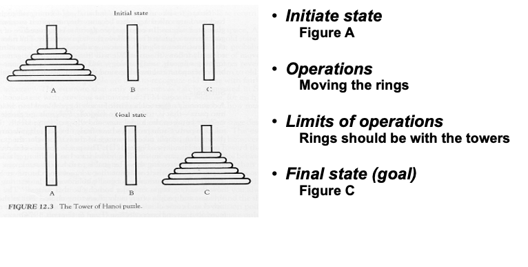
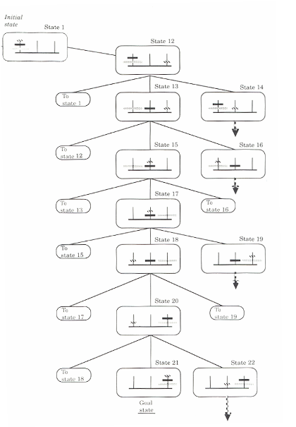
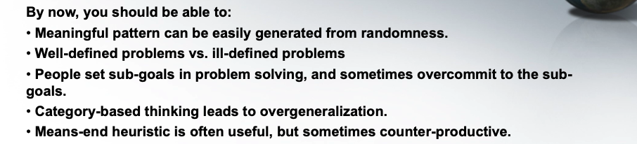

# Week4 Problem Solving 

## Defination of problem 
Four elements of a problem:
1. Initiate state
2. Operations (the means)
3. Limits of operations
4. Final state (goal)

Example:

### Type of problem 

1. Well-defined problem : The four elements are very clear

    E.g., the tower of Hanoi puzzle

2. Ill-defined problem : The four elements are not clear

    E.g., My goal is to be a successful person

## Strategies in probelm solving 

1. Trials and errors
- May be used for initial stages of problem solving
- May be useful if the movements or the steps are reversible
- But it is not always feasible

2. State Space Analysis
- List all possible states…
- You must get the solution
    - You must get the solution
    - But maybe quite time consuming…
    
    

3. Working backward

- From the end-state work backward…

4. Analogy 
- Found some similiar case

*** sometime we need to think of the mid state to complete the final state

## Obstacles in Problem Solving

### Means-end Analysis
Means-ends
- Reducing the discrepancy between the initial/current and 

final states
- It is useful for many cases
- But it is harmful in some cases

Sub-goal
- Break the goal into several sub-goals

- Usually follow the means-ends heuristics
Sometimes
- A problem has to be solved by steps that increase the discrepancy between the current state and the final state

### Category-based thinking 

We are heuristic all the time, we trend to simplify the world and hence reduce cognitive loading. 

And sometime stereotype is the helping us to category somethings

Try to avoid the category-based thinking 

