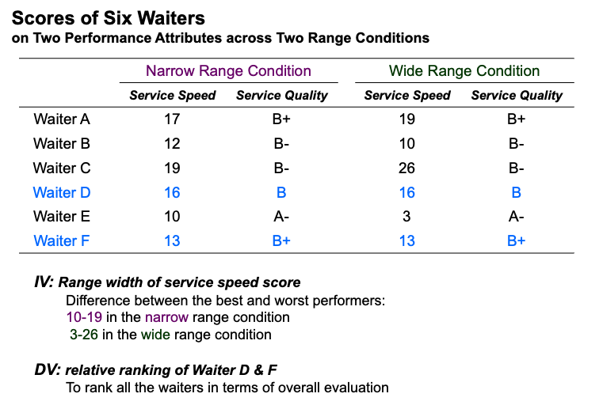
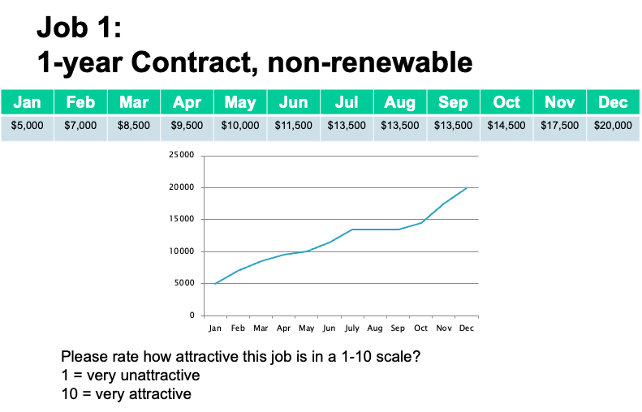

# Week5: Specfic Decision Biases

## Preference Reversals

### Defining preference reversals
- Unstable preference across conditions
- People prefer Option A  > Option B  in one condition
- They prefer Option B  > Option A  in another condition
- Information of Option A & Option B in the two conditions are essentially identical !!

### Framming 

People need to make a comparsion point to make decision 

### Six Errors(Way) leading to preference reversals

#### 1. Decoy Effects 

    Basically, just make a thrid one to people to choice 

    An rationale thinking is if the new choice is easier to spot worse than the choice we want people to take 
    then will select the choice we prepared

    Choice A and B remains same but c does not  
    Condition A 
    
    people will trend to select A
    
    Condition B
    
    people will trend to select B

#### 2. Number Size Framing

Free throw performance

if descibes the hit in other way : miss rate
which seem look like more better than  89% vs 89%

Another example 

KPI. 

it shows David and Andy are closed 

again 

3. Range Effects

We should use the shorten range 
like the  survey can range 0-10 or 0-100

4. Joint-Separate Preference Reversal
show 2 job 1 by 1 

choice job a 

But if show at the same time 

kind of hard to make the decision 

Experiment 

5. Scale-type Preference Reversal

Just find a scale is better to u 

6. Memory Reconstruction

Asking positive or negative attributes. from supportve or not to fair & honest. 

### Conclusion 
Concluding Remarks:
Comparing with my competitor, if I am the inferior (superior) one, how can I reduce or even reverse (increase) the difference? 
Six ways:
- Adding an appropriate decoy 
- Changing the number size
- Changing the range information 
- Joint vs. Separate information
- Changing the scale of evaluation
- Asking positive or negative attributes

## Other Common Decision Bias

### 1. Gambler’s Fallacy

But in fact, the probability is still 1/2

### 2. Contrast Effect
Three Candidates in Job Interviews

1. You
2. David: Strong Candidate
3. Peter: Weak Candidate

The order of interview (partly) determines your performance
You after Peter > You after David

### 3. Illusion of Control

### 4. Halo Effect
「月暈效應」(Halo effect)是一種以偏概全的主觀心理臆測，是在人際交往中對一個人進行評價時，往往因對他的某一方面特徵，掩蓋了其他特徵，從而造成人際認知的障礙。 一個人表現好時，大家對他的評價遠遠高於他實際的表現