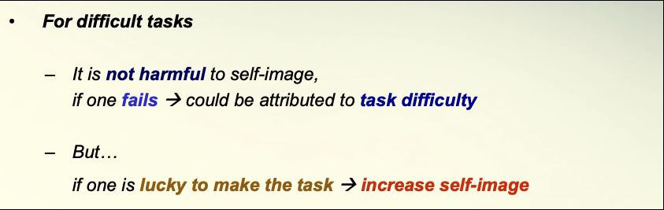

# week6:Self-affirmation

## Confirmation biases

In fact we cannot confirm anything by positive case

- Only falsification will lead to conclusive understanding
- Confirmation (verification) always lead to ambiguous understanding
- Truth cannot be proven and cannot be rejected

for more details please refer word file: Class 6 -- Self affirmation-c.doc

### Self fulfilling prophecy
People tend to create opportunities for themselves to “confirm” that their beliefs are correct

This biases the opportunities, and hence increases the likelihood of the occurrence of the expected results

### Self esteem 

The Confirmation biases come from Restoration of self esteem

People tend to take tasks that increase their self esteem
After getting poor performance, people tend to seek alternative ways to restore self esteem 

## Escalation of Commitment 
People tend to increase their commitment and efforts towards a failing course of action
Particularly when one is responsible for the failing course of action

Three defining features of an escalation situation
A certain amount of resources invested in a course of action
There is indication that the course of action is likely failing
There is an opportunity to quit or to persist

More examples of escalation of commitment

1. In interpersonal relationship

    Some people refuse to leave their spouses who often abuse them…

2. Wars
    
    Vietnam Wars, Wars in Iraq

3. In religion

    Fundamentalists refuse to accept the scientific facts of evolution and evolutionary theory

4. Global Warming 

### Overcoming Escalation Bias

1. Changing the person in charge

2. Setting a pre-determined cut-off point (止蝕位)

3. Forming some falsifiable predictions on your own beliefs

    e.g. How a poor staff should be???

## Overconfidence

People tend to overestimate their performance  in moderate to difficult tasks

### Illusion of control

Overconfidence is more salient for tasks that
    
(a) Allow people to control it, But in fact the control is irrelevant to the outcomes
    
(b) Provide a lot of information, But in fact the information is irrelevant to the outcomes

### Hard-easy effect 

Hard - easy effects

People tend to :
- overestimate their ability in difficult tasks
- underestimate their ability in easy tasks

#### “maintenance of self-image”

Overconfidence increases the chance of taking this ***“no-loss-many-gains”*** challenge

Underconfidence decreases the chance of engaging in this ***“many-losses-no-gain”*** situations

### Common syndromes

1. Reduce their task preparation
2. Not try as hard as they could during the task
3. Give their opponent an advantage
4. Perform poorly in the beginning of a task in order not to create unreachable expectations…
