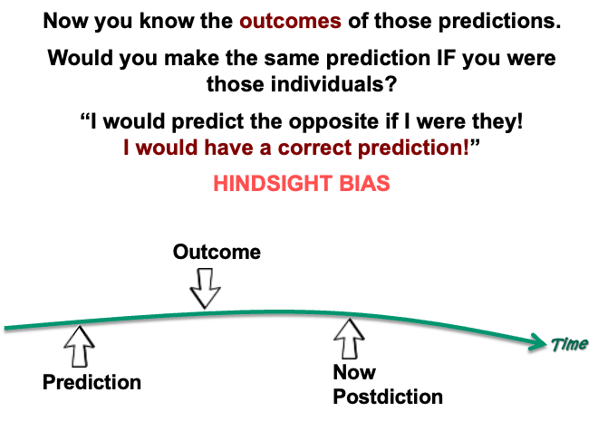
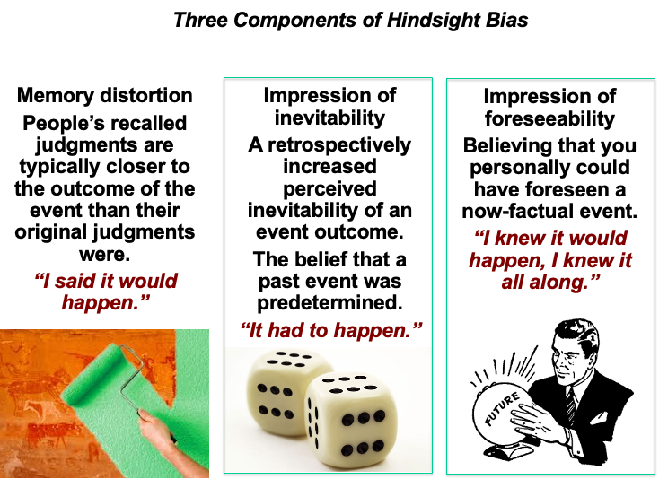
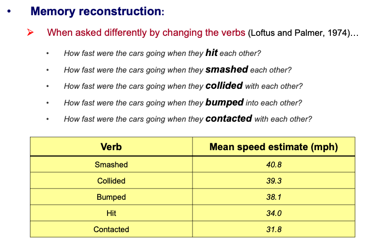
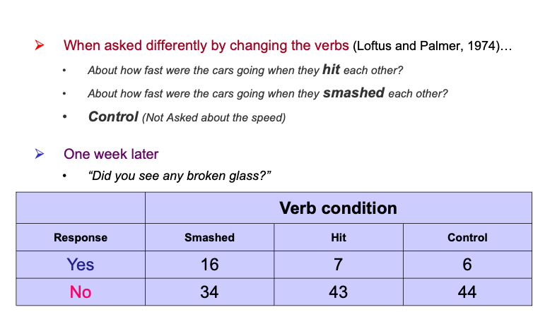

# Week7 : Others 

## Conformity and Obedinece 

Obedience also affect the people making the decision 

in Milgram Experiment (Derren Brown)
Authority make people make a wrong decision 
## Hindsight Bias 馬後砲

After finding out whether or not an event occurred, individuals tend to overestimate the degree to which they would have predicted the correct outcome

## Explanations of hindsight bias

1. Self-serving bias
2. Memory confusion
    - Part of the bias is automatic and is not due to motivational factors
    - Sometimes, we may need to show more forgiveness to those who exhibit hindsight biases

However,
-  There is one situation in which people exhibit no hindsight bias…
    - Try to give me your insights into this situation..

- When one’s initial decision led to negative results, people tend to say: 
    - The results are out of my prediction…

***Again self-serving…***

## Memory Bias

you can see the wording it ask, can construct how people determine the result 